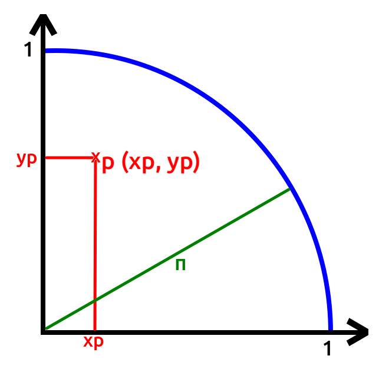
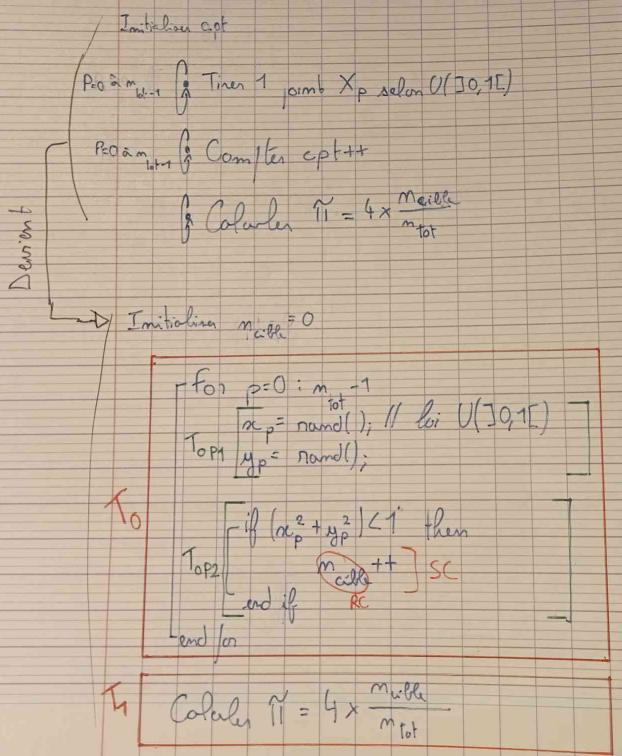
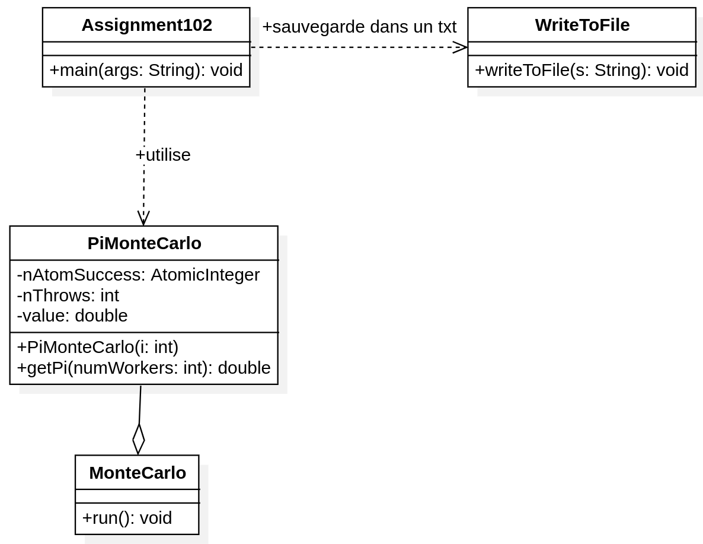
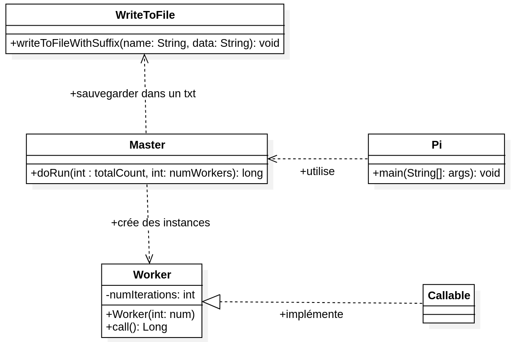
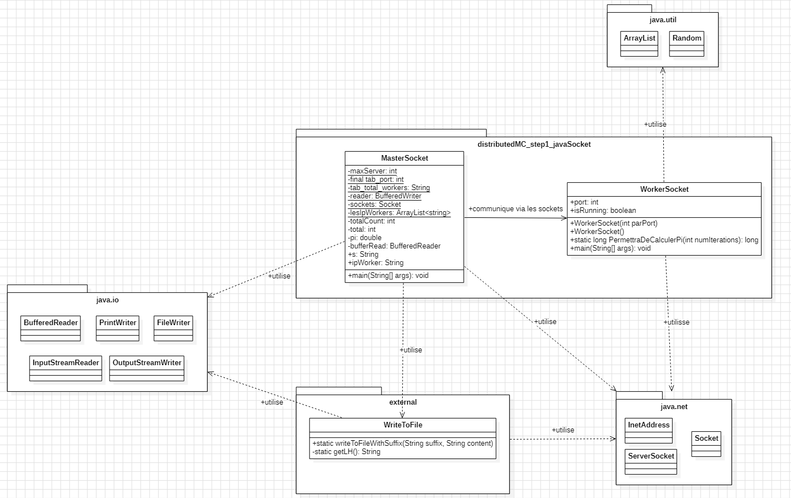

Matthieu FARANDJIS
INF3-FI

<div align="center">

<h1>Programmation Avancée & Qualité de développement</h1>
<h2>- Rapport n°2 -</h2>
</div>


### Rappel définitions : <br>


<br><br>
### Liens intéressants :

**Sur  :** https://<br>

<br><br>
## Plan

- **I - Méthode de Monte-Carlo**
- **II - Algorithme et parallélisation**
  - a) Itération parallèle
  - b) Master-Worker
- **III - Mise en œuvre sur machine à mémoire partagée**
  - a) Analyse d'Assigment102
  - b) Analyse Pi.java
- **IV - Qualité et test de performance (cf R05.08 Q Dev)**
- **V - Mise en œuvre en mémoire distribuée**
  - a) (Analyse) JavaSocket
  - b) MasterWorker
- **VI - Test de performance Master-Worker distribuée**
<br><br><br>


## I - Méthode de Monte-Carlo

La méthode de Monte-Carlo permet de prédire un résultat à partir d'un ensemble de valeurs générées aléatoirement.<br>
Elle effectue plusieurs itérations pour recalculer et affiner le résultat.<br>
L'un des principes fondamentaux de la méthode est qu'une augmentation du nombre d'itérations améliore la précision de l'estimation.<br>
<br>
*Méthode d'après IBM : https://www.ibm.com/fr-fr/topics/monte-carlo-simulation* <br>
<br><br>
**Calcul de π par une méthode de MonteCarlo, d'après le TP4 fait en cours**<br>
Soit l'aire $`A_{\tfrac{1}{4}d}`$ d'un quart de disque de rayon $`r = 1`$.<br>

$$A_{\tfrac{1}{4}d} =  \frac{\pi r^2}{4} = \frac{\pi}{4}$$


<br><br>
_**Figure 1 :** Tirage aléatoire dans un carré de côté r = 1._


Soit l'aire d'un carré de côté $`r=1`$, $`A_{c} = r^2 = 1`$ <br>
<br>
Soient les points $`X_{p}(x_{p},y_{p})`$ dont les coordonnées sont tirées selon une loi $`U (]0,1[)`$.<br>
La probabilité que $`X_{p}`$ soit tiré dans le quart de disque est

$$P = \frac{A_\frac{{1}{4}d}{A_{c}}} = \frac{\pi}{4}$$

On effectue $`n_{tot}`$ tirages aléatoires.<br>
Soit $`n_{cible}`$ le nombre de points tirés dans le quart de disque.<br>
<br>
Si $`n_{tot}`$ est rand, alors on peut approximer P pour $`P = \frac{n_{cible}}{n_{tot}} \approx \frac{\pi}{4}`$<br>
<br>
D'où $`\pi \approx 4 \times \frac{n_{cible}}{n_{tot}}`$<br>
<br><br>

**ALGORITHME : Implémentation séquentielle de la méthode de Monte-Carlo**<br>




- On identifie deux
  - T0 : Tirer et compter $`n_{tot}`$ points
  - T1 : Calculer $`\pi`$
- T0 se décompose en $`n_{tot}`$ sous tâches
  - $`T_{0P1}`$ : tirer $`X_{p}`$
  - $`T_{0P2}`$ : incrémenter $`n_{cible}`$
- *Dépendance entre tâches :*
  - T1 dépend de T0
  - $`T_{0P2}`$ dépend de $`T_{0P1}`$
  - Les $`T0P1`$ sont indépendats selon p
  - Les $`T0P2`$ sont indépendats selon p


<br><br><br>
## II - Algorithme et parallélisation

### a) Itération parallèle

L'itération parallèle est aussi appelée parallélisme de boucle et parallélisme itératif.<br>
Dans un algorithme parallèle, on suppose que le calcul effectué par une unité de calcul est indépendant de celui effectué par une autre unité de calcul.<br>
L'adjectif "parallèle" attribué à un tel algorithme provient du fait que cela correspond à une architecture de type SIMD (une Seule Instruction, Plusieurs Données).<br>
*Source :*
  - *Explications adaptés pour Assigment102 :*<br>
    https://dpt-info.u-strasbg.fr/~cronse/TIDOC/ALGO/parseq.html


<br>
L'algorithme à itération parallèle de la méthode de Monte-Carlo que nous avons étudié est Assignment102.<br>
<br>

Voici un extrait du code d'Assigment102 :<br>
```
	class MonteCarlo implements Runnable {
		@Override
		public void run() {
			double x = Math.random(); // génération d'un nombre aléatoire, donc avec y => génération d'un point
			double y = Math.random(); // Si on précise une graine (seed) : le tirage est déterministe. Utile si on veut retester le code (donc en s'assurant qu'on obtient le même résultat)
			if (x * x + y * y <= 1)
				nAtomSuccess.incrementAndGet(); // On remarque que ça resemble à notre pseudo code avec machin++. C'est un msg envoyé à nAtomSuccess
		}
	}

	public double getPi(int numWorkers) {
		int nProcessors = numWorkers; // runtime : c'est l'environnement pendant le temps d'exécution du code. Ici elle nous propose de regarder le nb processeurs dispo
		ExecutorService executor = Executors.newWorkStealingPool(nProcessors); // il fixe le nb de thread au nb de processeur détecté par la JVM (donc si dans le bios on a autorisé l'hyperthreading, alors il va dire que c'est 8 professeurs (8 coeurs en réalités), sinon 4)
		for (int i = 1; i <= nThrows; i++) {
			Runnable worker = new MonteCarlo();
			executor.execute(worker);
		}
		executor.shutdown();
		while (!executor.isTerminated()) {
		}
		value = 4.0 * nAtomSuccess.get() / nThrows;
		return value;
	}
```

### b) Master-Worker

Le premier algorithme Master-Worker de la méthode de Monte-Carlo que nous avons étudié est Pi.java.<br>
Master crée puis lance des tâches qui, via le paradigme des futures, font une résolution de dépendance.<br>
<br>
Pi.java est plus efficace que Assignment102, puisque si l'on crée 500 000 tâches, l'OS gère lui-même celles-ci, ce qui prend plus de temps que de faire :
génération nombre aléatoire x, génération nombre aléatoire y, test, incrément (~40 cycles).<br>
<br><br>
Il est difficile de montrer un exemple du code calculant Monte-Carlo, mais nous pouvons le visualiser via le code disponible sur ce dépôt.<br>
<br><br>


<br><br><br>

## III - Mise en œuvre sur machine à mémoire partagée

### a) Analyse d'Assigment102

Le code de Assignment102 calcule une valeur approximative de 𝜋 à partir de la méthode de Monte-Carlo.<br>
On y retrouve deux dépendances nouvelles : AtomicInteger et Executor.<br>

- **Atomic Integer :**<br>
  Encapsule une valeur entière qui peut être mise à jour de manière atomique.<br>
  C'est-à-dire que toutes les opérations de lecture-modification-écriture sur cette valeur sont effectuées comme une seule unité insécable. Cela garantit la sécurité des threads (thread-safety) sans nécessiter de synchronisation explicite.<br>
  Un AtomicInteger est utilisé dans les applications telles que les compteurs incrémentés atomiquement et ne peut pas être utilisé comme remplacement d’un java.lang.Integer.<br>
  <br>
  *Sources :*
  - *https://www.jmdoudoux.fr/java/dej/chap-acces_concurrents.htm*
  - *https://learn.microsoft.com/fr-fr/dotnet/api/java.util.concurrent.atomic.atomicinteger?view=net-android-34.0*
  - *ChatGPT (la phrase du "C'est-à-dire")*
    <br><br><br>
- **Executor :**<br>
  L'interface java.util.concurrent.Executor décrit les fonctionnalités permettant l'exécution différée de tâches implémentées sous la forme de Runnable.<br>
  C’est un support pour les Threads en Java à un plus haut niveau que la classe Thread.<br>
  Il permet de découpler la soumission des tâches de la mécanique des Threads (Execution, Ordonnancement)<br>
  On peut ici gérer des pool de Threads. Chaque Thread du pool peut être réutilisé dans un Executor.<br>
  L’interface Executor définit la méthode execute.<br>
  <br>
  *Sources :*
  - *https://jmdoudoux.developpez.com/cours/developpons/java/chap-executor.php#executor-1*
  - *Cours de M. DUFAUD : CM4-complement-parallelisation-et-Java.pdf*
- **Algorithme Workstealing (abordé en cours) :**<br>
  Le principe de cet algorithme est que chaque worker possède une liste de tâche.<br>
  Lorsqu'un worker n'en possède plus, plutôt qu'attendre de nouvelles tâches, il va en extraire chez un autre worker.<br>
  <br>
  De telle manière, non seulement chaque worker à peu peut près le même nombre de tâches, mais aussi, on s'assure que les workers soient toujours actif.<br>
  On garanti donc l'optimisation du fonctionnement du programme.<br>
  *Sources :*
  - https://www.linkedin.com/advice/0/what-benefits-drawbacks-using-work-stealing?lang=fr&originalSubdomain=fr
- **Les futures :**<br>
  Paradigme de programmation qui est très pratique, qui permet de définir quand on créer notre tâche le schéma de dépendance entre les tâches.<br>
  L'idée est de dire que la tâche va envoyer un résultat dans le futur; On ne sait pas quand il va l'envoyer, mais plus loin dans le code on va utliser son code.<br>
  On dit que la tâche x va envoyer un res y dans le temps. la tâche s'éxecute, on continu le code (d'autres trucs s'exécutent), puis un moment x renvoi le resultat, et on fait un calcul.<br>
  - le code à ce moment là, pour calculer doit attendre le resultat de x, c'est un point de synchronisation

<br><br>
On définit un objet executor qui est un support de thread.<br>
On va lui dire : tu définie le nombre de threads que tu vas utiliser.<br>
-> il permet de faire l'association entre des tâches et des threads de manière dynamique en fonction de l'exécution des tâches en cours.<br>
-> Il est donc possible d'associer 1000 tâches à 4 threads (au lieu de 1000 tâches = 1000 threads dans le TP mobile, vu qu'on ne pouvait pas utiliser Executor).<br>
<br>
===> On utilise désormais la classe Executor, plutôt que la classe Thread.<br>
Le fait est que les threads en Java présentent de nombreux inconvénients essentiellement liés au fait que cette classe est de bas niveau.<br>
De ce fait, elle ne propose pas des fonctionnalités tel qu'obtenir un résultat d'exécution d'un thread ou encore attendre la fin d'un ensemble de threads.<br>
<br>
*Sources :*<br>
*https://jmdoudoux.developpez.com/cours/developpons/java/chap-executor.php#executor-1*

<br><br>
**Note :**
- start et run sont deux choses différentes
- V est un type générique
- overhead : ordonnanceur de l'OS

<br><br>
**Quelques annotations sur le code :**<br>
- **double y = Math.random();**
  - Si on précise une graine (seed) : le tirage est déterministe. Utile si on veut retester le code (donc en s'assurant qu'on obtient le même résultat)
- **int nProcessors = Runtime.getRuntime().availableProcessors();**
  - runtime : c'est l'environnement pendant le temps d'exécution du code. Ici elle nous propose de regarder le nb processeurs dispo
- **Executors.newWorkStealingPool(nProcessors);**
  - il fixe le nb de thread au nb de processeur détecté par la JVM (donc si dans le bios on a autorisé l'hyperthreading, alors il va dire que c'est 8 professeurs (8 coeurs en réalités), sinon 4)
<br><br>

Voici un diagramme UML d'Assigment102 :<br>
<br>

*Les outils suivants m'ont aidé : StarUML, ChatGPT*<br>

### b) Analyse Pi.java


**Paradigme de Pi.java :** Master Worker

On a un Master qui va créer puis lancer des tâches qui via le paradigme des futures fait une résolution de dépendance.<br>
<br><br>

Voici un schéma montrant l'interraction entre 1 Master et 3 Workers : <br>
<br>

*Les outils suivants m'ont aidé : Excalidraw*<br>


<br><br>
Pi.java est plus efficace que Assigmnent102, puisque si on créer 500000 tâche, l'OS gère lui-même ce qui prend plus de temps que de faire :
génération nb aléatoire x, génération nb aléatoire y, test, incrément (~40 cycles).<br>
<br><br>
**Quelques annotations sur le code :**<br>
- **Executors.newFixedThreadPool(numWorkers)**
  - Renvoyer une instance de type ExecutorService qui utilise un pool de threads dont la taille est fixe. Les tâches à exécuter sont stockées dans une queue
    <br><br>

Voici un diagramme UML de Pi.java :<br>
<br>

*Les outils suivants m'ont aidé : StarUML, ChatGPT*<br>


<br><br><br>

## IV - Qualité et test de performance (cf R05.08 Q Dev)

### a) Mise en place

De prime abord, Assigment102 et Pi.java affiche les résultarts de manière différente. Afin de mieux comparer et étudiier leurs efficacités, nous avons du uniformiser les sorties.<br>
C'est à dire s'assurer que chaque code affiche/renvoie la même chose.<br>
<br><br>
Ainsi les prints ci-dessous sont dans le même format que ce soit dans Assigment102 ou Pi.java.<br>

<br>
**Code de Pi.java**

<br><br>
Pour traiter ces informations et facilité l'automatisation du lancement de plusieurs fois d'affiler le code, nous allons sauvegarder ces informations dans un document.<br>
Pour cela on va créer une classe WriteToFile  :<br>

<br><br>
Comme nous pouvons le voir, on créer en premier un nom à notre fichier.<br>
Nous indiquons le jour du test, ainsi que la machine sur lequel on teste (grâce à `InetAddress.getLocalHost()`), sachant que le nom de chaque machine de l'IUT correspond à la salle et à sa position dans la salle.<br>
C'est indispensable car les résultats peuvent variés d'une machine à l'autre.<br>
Pour de meilleurs résultats, dans les faits, il faudrait même fermer tous les logiciels ouvert, voir même utiliser le terminal plutôt qu'IntelliJ et dans l'idéal, ne pas d'utiliser l'interface graphique Windows.<br>
<br>
Ensuite nous écrivons à la suite du fichier les données reçu, on sauvegarde et on affiche si tout s'est bien passé ou non.<br>

<br><br>
Enfin, nous allons traiter ces fichiers via un programme Python afin d'établir un graphique et étudier les résultats.<br>
Plus précisément, nous allons étudier la scalabilité forte et faible d'Assignment102 et Pi.java sur les critères de temps d'exécution et de speed-up.<br>

### b) Définitions des termes
- **Speed-up :**<br>
  Le speed-up, noté Sp, est le gain de vitesse d’exécution en fonction du nombre de processus P.<br>
  L'idée est donc de mesurer le gain de performance obtenu en exécutant une tâche sur plusieurs processeurs (ou cœurs) par rapport à un seul processeur.
- **Temps d'exécution**<br>
  Le temps d'exécution correspond au temps que demande le programme pour effectuer le calcul de pi.<br>
  Dans le cas du paradigme Master-Worker, le temps d'exécution correspond au temps des échanges entre le Master et les Workers + le temps que demande les Workers pour calculer + le temps d'assembler un résultat final par Master.
- **Scalabilité forte :**<br>
  La scalabilité forte consiste étudier ce qu'il se passe lorsque l'on ajoute des processus pour un problème de taille fixe.
- **Scalabilité faible :**<br>
  La scalabilité faible consiste étudier ce qu'il se passe lorsqu l'on augmente simultanément la taille du problème et le nombre de processus.

### c) Analyse
L'objectif de cette étude est de prouver quel est le meilleur paradigme pour calculer Pi à l'aide de la méthode de Monte-Carlo entre Assignment102 et Pi.java.<br>
<br>
Pour rappel :
- Paradigme d'Assignment102 : Itération parallèle
- Paradigme de Pi.java : Master-Worker

<br><br>

Les tests suivant ont été effectués sur mon ordinateur personnel, voici sa configuration :

- Processeur : Intel Core i5-9400F, 2.90Ghz, 6 Coeurs, 1 Socket
- RAM : 8Go
- Windows 10 Home 22H2, build : 19045.5247
- Carte Graphique : NVIDIA GeForce FTX 1050
- Attention, certains logiciel fonctionnaient en fond, par ailleurs l'interface graphique de Windows était démarré. Cela influe sur les performances de l'ordinateur.

Résultats obtenus :


- **Expérience n°1 en Scalabilité Forte : Est-ce que le temps d’exécution diminue lorsque j’ajoute des processus pour un problème de taille fixe ?**
  
  Nous remarquons que contrairement à Assignment102, pour Pi.java, le temps d'exécution diminue.<br>
  Cela s'explique par le fait que l'on divise la taille du problème entre les processus. Vu que les processus traite des problèmes de plus en plus petit, c'est très rapide bien qu'ils soient nombreux.<br>
  En revanche, pour Assignment102, nous donnons un problème de même taille à chaque processus, donc ça ne peut qu'augmenter. Cependant nous remarquons que ça augmente de plus en plus lentement. <br>
  <br>
  Pi.java est donc le gagnant de cette expérience.


- **Expérience n°2 en Scalabilité Forte : Comment les ressources sont utilisés lorsque j'ajoute des processus pour un problème de taille fixe ?**
  

  La courbe bleu correspond au speed-up idéal en fonction du nombre de processus.<br>
  Cela signifie que dans l'idéal, si la méthode est parfaitement parallèle, le fait de doubler le nombre de processus divise par deux le temps de calcul. En d'autre terme : il y a une excellente répartiion des ressources.<br>
  <br>
  - **Pi.java**<br>
    Nous remarquons que le speedup suit le speed-up idéal au début lorsque l'on utilise 1 à 4 processus, puis augmente très lentement de 4 à 16 processus avant de stagner.<br>
    Cela signifie que Pi.java est efficace lorsque l'on utilise un petit nombre de processus.<br>
    Après cela, on peut déduire que l'interaction de plus en plus importante entre le Master et les Workers fait perdre de l'efficacité au programme. Ce temps de traitement de plusieurs processus par la machine s'appel "overhead", nous en parlons en partie V a).
  - **Assignment102**<br>
    C'est la catastrophe ! Même avec plus de processus, le résultat est mauvais : cela tend vers 0.<br>
    Cela ressemble à une courbe de scalabilité faible (voir expérience n°4), mais c'est bien le résultat de notre expérience en scalabilé forte.<br>
    On en déduit une très mauvaise répartition de la charge de travail entre les processus, chose que nous avons déjà remarqué dans l'expérience n°1.
  
  <br>
  Par conséquent, Pi.java est de nouveau vainqueur : cet algorithme est plus efficace qu'Assigment102.


- **Expérience n°3 en Scalabilité Faible : Est-ce que le temps d’exécution diminue lorsque j’augmente simultanément la taille du problème et le nombre de processus ?**
  
  Nous remarquons que dans les deux cas, le temps d'exécution augmente. Cependant, ici également Pi.java reste le plus effiace : il augmente beaucoup moins vite qu'Assignment102 si l'on se fie à l'axe des ordonnées.<br>
  Nous remarquons également que c'est une courbe linéaire, ce qui est normal puisque le problème grandi proportionnellement au nombre de processus.<br>
  Il est a noté que dans le cas de Pi.java, de 1 à 4 processus le temps est constant, ça augmente dès qu'il y a plus de 4 processus.
  <br>
  Même lors d'une étude de scalabité faible, Pi.java est mieux qu'Assignment102.


- **Expérience n°4 en Scalabilité Faible : Comment les ressources sont utilisés lorsque j’augmente simultanément la taille du problème et le nombre de processus ?**
  
  Notre observation rejoins l'oberservation sur l'expérience n°2 : augmenter le nombre de processus ne permet pas toujours d'avoir un bon speed-up, même si la taille du problème augmente proportionnellement.<br>
  En effet, comme dans l'expérience n°2, de 1 à 4 la courbe suit le speed-up idéal, après cela le coût des communications entre le Master et les Workers influe trop sur les performances.<br>
  De même que dans l'expérience n°2, Assignment102 s'effond rapidement.<br>
  <br>
  Seulement, je me demande si Pi.java ne stagne pas comme Assignment102 à partir de 128 processus lorsque l'on compare l'allure des deux courbes.
  <br>
  La conlusion reste là mêmen Pi.java est mieux qu'Assignment102.<br>


A l'issue de ces quatre expérience, la conclusion est sans apppel : le paradigme Master-Worker offre des meilleurs résultats avec la méthode de Monte-Carlo que le paradigme d'itération parallèle.
<br><br><br>

## V - Mise en œuvre en mémoire distribuée

### a) (Analyse) JavaSocket

En Software, le **socket** est un fichier contenant des informations.<br>
Toutes nos données, toutes les cases mémores sont mis dans un fichier qui est transmis dans le réseau.<br>
<br>
Nous en venons au terme **overhead** qui est le temps de traitement de plusieurs processus par la machine.<br>
On peut le diminuer en augmentant la charge d'un processus, car traiter quelques gros processus est moins couteux que de gérer plusieurs petit processus.<br>
C'est pour cela que l'architecture d'une carte graphique, utile pour des calcules parallèles n'est pas adapté pour faire fonctionner un système d'exploitation.<br>
Une carte graphique gère plusieurs petits processus contrairement à un processeurs qui en gère principalement des gros. Avec un GPU, le système serait donc très lent !<br>

### b) MasterWorker

Pour le dernier projet, on utilise deux fichiers java :

- Master, qui gère les Workers lancés sur différents ports
- Worker, qui se lance sur un port précis. Ce qui permet d'en lancer plusieurs simultanéments sur différents ports.<br>
  <br><br>
  Notre objectif à terme est de lancer un Master sur un ordinateur, et utiliser les Workers qui sont sur d'autres ordinateurs.<br>
  En conséquence, le code est prévu pour : après une petite modification on peut donner des ip personnalisés à Master pour accéder aux autres ordinateurs.<br>
  Pour le moment, nous allons tester sur une seule machine.<br>

Voici un diagramme UML complet de Master-Worker :<br>
<br>

*Les outils suivants m'ont aidé : StarUML, ChatGPT*<br>

<br><br>

J'ai du rajouter un morceau de code pour exécuter la méthode de Monte-Carlo ainsi que l'enregistrement dans un fichier texte comme pour Assigment102 et Pi.java.<br>
On reprend simplement le morceau de code d'Assigment102 permettant de calculer Pi que l'on place dans une fonction qu'on appel.<br>
On aurait pu directement l'intégrer au code, seulement celui-ci serait moins maintenable, il serait plus dure de retrouver puis de remplacer le morceau.<br>
Ici on sait ce qu'il a précisément besoin et ce qu'il doit renvoyer, faire.<br>
<br>
<br>


<br>**Pour lancer et changer de port :**
- **Lancer sur le port 25545 :**<br>
  Sur IntelliJ pour WorkerSocker :
  - Cliquer sur le bouton "3 points vertical", puis "Edit" et mettre "25545" dans le port (sous distributedMC).
- **Lancer plusieurs instances :**
  Sur IntelliJ pour WorkerSocker :
  - Cliquer sur le bouton "3 points vertical", puis dans "Config", dans "Modify options (Build and Run)", cocher Allow m... (CTRL+U) en haut de la liste.
<br><br>
Si nous exécutons nos programmes sur une seule machine, la répartition des Worker + Master correspond au schéma du III - b).<br>
Si nous l'exécutons sur plusieurs machine, cela correspondrais à ça :
<br>

## VI - Test de performance Master-Worker distribuée
